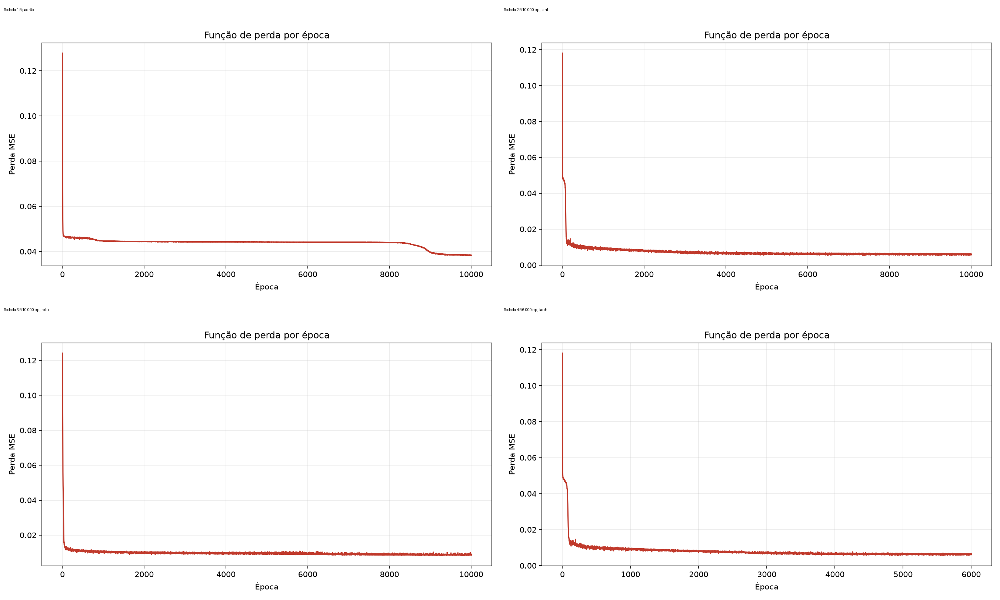

# Comparativo das rodadas — `neural_net_v2`

As quatro rodadas foram executadas de forma independente, utilizando o mesmo conjunto `make_moons`, a mesma divisão treino/teste e a mesma semente aleatória do script. A animação foi desativada apenas durante a execução automatizada para evitar bloqueio da janela gráfica; o arquivo `neural_net_v2.py` não foi alterado para produzir estas rodadas.

## Parâmetros e resultados

| Rodada | Épocas | Neurônios por camada oculta | Camadas ocultas | Camadas totais | Ativação | Acurácia treino | Acurácia teste |
|---|---:|---:|---:|---:|---|---:|---:|
| 1 — padrão | 10.000 | 2 | 2 | 3 | `tanh` | 0,887 | 0,887 |
| 2 — rede ampliada | 10.000 | 4 | 4 | 5 | `tanh` | 0,990 | 0,970 |
| 3 — rede ampliada com ReLU | 10.000 | 4 | 4 | 5 | `relu` | 0,979 | 0,967 |
| 4 — rede ampliada otimizada | 6.000 | 4 | 4 | 5 | `tanh` | 0,989 | 0,973 |

Na segunda rodada, o número de épocas foi mantido em 10.000 porque a função de perda da primeira rodada ainda apresentava redução no trecho final. Como quatro camadas ocultas exigem uma camada de saída adicional, o total de camadas passou de 3 para 5 para manter a arquitetura válida.

A quarta rodada foi executada com a configuração que apresentou o melhor equilíbrio na análise anterior: a arquitetura ampliada com quatro camadas ocultas, quatro neurônios por camada e `tanh`. O total foi reduzido para 6.000 épocas porque a curva da segunda rodada já apresentava perda praticamente estável a partir dessa faixa, permitindo reduzir o custo computacional sem prejudicar o desempenho.

## Análise da função de perda

A primeira rodada começou com perda próxima de `0,128` e convergiu para a faixa de `0,04`. A rede ampliada com `tanh` apresentou uma redução mais acentuada, chegando à faixa de `0,006`. Com `relu`, a perda também foi baixa, mas permaneceu próxima de `0,009`, acima do resultado obtido com `tanh`. A quarta rodada atingiu perda próxima de `0,006` usando 4.000 épocas a menos que a segunda rodada.

## Conclusão

A ampliação da rede produziu a maior melhoria: a acurácia de teste passou de `0,887` para `0,970` usando `tanh`. A troca de `tanh` por `relu`, mantendo a arquitetura ampliada, reduziu ligeiramente o desempenho de teste para `0,967`. A quarta rodada confirmou a escolha da arquitetura ampliada com `tanh`: mesmo com 6.000 épocas, obteve a maior acurácia de teste entre todas as rodadas (`0,973`), superando a rodada 2 (`0,970`) e reduzindo o custo de treinamento em 40%.

Portanto, a melhor configuração observada neste experimento é: 6.000 épocas, 4 neurônios por camada oculta, 4 camadas ocultas, 5 camadas totais e ativação `tanh`. Essa conclusão deve ser interpretada com cautela, pois a diferença entre as rodadas 2 e 4 é pequena e cada configuração foi executada uma única vez.

Os resultados não constituem uma comparação estatística completa, pois cada configuração foi executada uma vez. Para uma avaliação mais robusta, seria necessário repetir cada rodada com várias sementes e comparar média e desvio-padrão.

## Arquivos gerados

- `rodada_1_padrao_funcao_perda.png` e `rodada_1_padrao_acuracia.png`
- `rodada_2_4camadas_4neuronios_tanh_funcao_perda.png` e `rodada_2_4camadas_4neuronios_tanh_acuracia.png`
- `rodada_3_4camadas_4neuronios_relu_funcao_perda.png` e `rodada_3_4camadas_4neuronios_relu_acuracia.png`
- `rodada_4_6000ep_4camadas_4neuronios_tanh_funcao_perda.png` e `rodada_4_6000ep_4camadas_4neuronios_tanh_acuracia.png`
- `comparativo_4_rodadas_funcao_perda.png`
